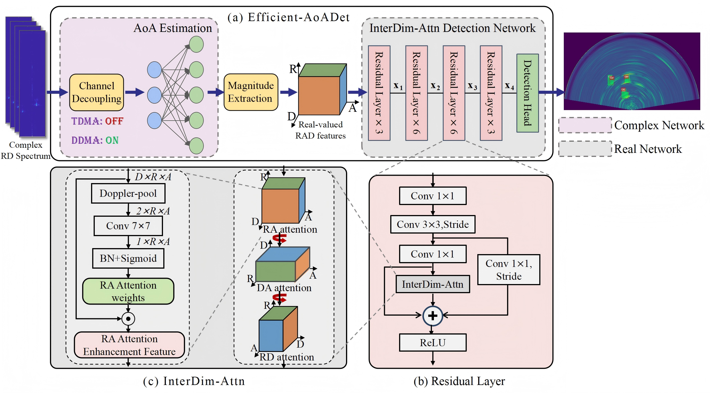

# Efficient-AoADet
Official PyTorch implementation of "Efficient-AoADet". A lightweight, physics-guided framework for radar object detection, tailored for the RADDet and RADIal datasets.

## Title: Physics-Guided and Jointly Optimized AoA Learning for Lightweight Radar Object Detection
## Abstract
Millimeter-wave radar is essential for robust perception in autonomous systems, as its performance remains independent of visual conditions. However, conventional multi-stage radar object detection algorithms often face challenges in real-time deployment due to computational inefficiency and limited task adaptability. To solve this engineering application challenge, we propose an efficient and physics-guided framework that integrates domain knowledge with data-driven learning to address these efficiency gaps. Unlike conventional methods, our proposed method operates directly on the compact complex-valued range-Doppler radar spectrum. To effectively extract information from this representation, our framework incorporates three jointly optimized modules. First, a complex-valued virtual channel decoupling module utilizes waveform structure priors to decouple virtual channels and eliminate Doppler aliasing. Second, a learnable complex-valued Angle of Arrival (AoA) estimation module, initialized from the Fast Fourier Transform (FFT) basis, replaces static angle-FFT to provide task-specific angular refinement at significantly lower cost. Finally, an Inter-Dimensional-aware attention mechanism exploits the anisotropic nature of radar data to enhance feature expressiveness. This end-to-end, multi-task joint optimization mechanism allows the entire system to learn task-aligned representations, boosting both robustness and efficiency. Extensive experiments demonstrate that our method significantly reduces overhead (up to 48.9% fewer parameters, 52.8% reduction in floating-point operations, and 7.6-fold faster inference) while achieving an 18.6% average improvement in detection accuracy over advanced multi-stage approaches. These results highlight a scalable and high-precision solution for real-time, intelligent radar perception on resource-constrained platforms.

## Method framework
The framework consists of three core modules: Channel Decoupling, AoA Estimation, and InterDim-Attn Detection Network. “TDMA: off” indicates that in TDMA mode, the virtual channel decoupling module is bypassed. “DDMA: on” means that in DDMA mode, the module is activated to reconstruct virtual channels.

## Main contribution
We introduce Efficient-AoADet, a lightweight radar object detection framework that integrates physics-guided signal modeling with multi-task joint optimization. This approach significantly enhances detection efficiency while maintaining robust performance. The main contribution of this paper is threefold:

  * A physics-guided, task-adaptive AoA estimation module. By replacing the traditional angle-FFT with a learnable linear transform implemented via a complex-valued neural network, this module operates directly on complex-valued signals, preserving their full phase information for precise AoA estimation. Initialized from the FFT basis, the design further enhances angular feature learning under end-to-end supervision while reducing both computational and storage overhead.
  
  * A physics-informed empty-Band Masked virtual channel decoupling strategy for DDMA-based HD radars. By embedding waveformspecific physical priors into the network, this module enables the accurate separation of signal contributions from individual TX antennas in the received data, leading to reliable and enhanced AoA estimation.
  
  * An InterDim-Attn module that is explicitly designed to capture the dependencies among radar’s physically distinct dimensions (range, Doppler, and angle), consistently enhancing detection precision and localization quality with minimal computational cost.

  * A physically guided phase-preserving strategy (complex-to-real hybrid pipeline) is employed, where phase information is preserved prior to AoA estimation to generate a high-precision angular spectrum, and subsequently real-valued magnitude features are utilized for object detection to suppress multipath-induced phase noise while improving computational efficiency.

## Code

Our proposed framework was initially validated on LD radar data, and subsequently extended to HD radar configurations to demonstrate its superior performance across different radar systems. We conduct experiments on two public datasets: the LD radar dataset RADDet and the HD radar dataset RADIal. 

This project includes separate implementations tailored for the RADDet and RADIal datasets. 

*   **[Code to be released upon acceptance][Model for RADDet Dataset](https://github.com/pangyangyang1122/Efficient-AoADet-RADDet.git)**: Implementation and instructions for the low-definition RADDet dataset. 

*   **[Code to be released upon acceptance][Model for RADIal Dataset](https://github.com/pangyangyang1122/Efficient-AoADet-RADIal.git)**: Implementation and instructions for the high-definition RADIal dataset.

## Citation

If you find this work useful for your research, please consider citing our paper:

```bibtex
@article{pang2026physics,
  title={Physics-guided efficient automotive radar object detection framework via multi-task joint optimization},
  author={Pang, Siqi and Guo, Kaitai and Zheng, Yang and Liang, Jimin},
  journal={Engineering Applications of Artificial Intelligence},
  volume={176},
  pages={114724},
  year={2026},
  publisher={Elsevier}
}
